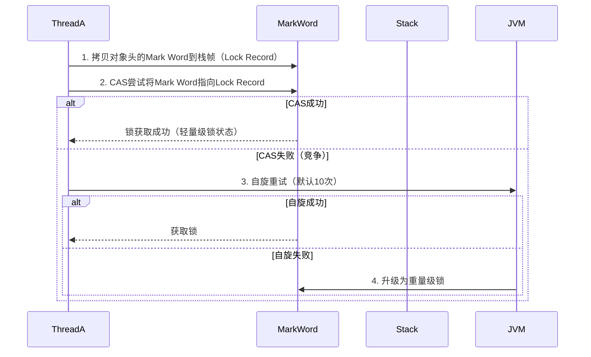

我们都知道被synchronized包裹的代码块具有同步的功能，其加锁的类型也会因多种因素影响下不同，影响的因素到底是什么呢。
首先我们需要知道加锁的类型主要是通过锁对象的对象头中的markworld字段来标识和实现的，32位的虚拟机，中markword的结构如下。

```
|-------------------------------------------------------|-----------------------|
| Mark Word (32 bits)                                   | State                 |
|-------------------------------------------------------|-----------------------|
| hashcode:25 | age:4 | biased_lock:0              | 01 | Normal                |
|-------------------------------------------------------|-----------------------|
| thread:23   | epoch:2 | age:4 | biased_lock:1    | 01 | Biased                |
|-------------------------------------------------------|-----------------------|
| ptr_to_lock_record:30                            | 00 | Lightweight Locked    |
|-------------------------------------------------------|-----------------------|
| ptr_to_heavyweight_monitor:30                    | 10 |  Heavyweight Locked    |
|-------------------------------------------------------|-----------------------|
|                                                  | 11 | Marked for GC         |
|-------------------------------------------------------|-----------------------|

```
# 偏向锁
偏向锁用于减少无竞争情况下的锁操作开销。其核心思想是，假设锁通常是由同一个线程多次获得的，因此可以“偏向”于该线程，而不进行频繁的同步操作。

如果一个线程获得了一把锁，那么锁会进入“偏向模式”，该线程在接下来的操作中将无需进行同步操作即可重新获得这把锁。

**出现条件：** 当一个对象第一次被锁定时，JVM会将其标记为偏向锁，并将获得锁的线程的ID记录在对象头的markword中。

该线程进入该对象锁定的代码块时，无需进行CAS操作，更无需申请monitor对象。
```java
@Slf4j
public class TestBiased {

    public static void main(String[] args) throws InterruptedException {
        Dog d = new Dog();
        ObjectHeader.parseObjectHeader(ObjectHeader.getObjectHeader(d));
        synchronized (d) {
            ObjectHeader.parseObjectHeader(ObjectHeader.getObjectHeader(d));
        }
        ObjectHeader.parseObjectHeader(ObjectHeader.getObjectHeader(d));
    }
}
class Dog{

}
```
结果：
```java
Class Pointer: 11111000 00000000 11101111 10010100 
Mark Word:
	ThreadID(54bit): 00000000 00000000 00000000 00000000 00000000 00000000 000000
	epoch: 00
	age (4bit): 0000
	biasedLockFlag (1bit): 1
	LockFlag (2bit): 01

Class Pointer: 11111000 00000000 11101111 10010100 
Mark Word:
	ThreadID(54bit): 00000000 00000000 00000000 00000000 00000010 11100111 010000
	epoch: 00
	age (4bit): 0000
	biasedLockFlag (1bit): 1
	LockFlag (2bit): 01

Class Pointer: 11111000 00000000 11101111 10010100 
Mark Word:
	ThreadID(54bit): 00000000 00000000 00000000 00000000 00000010 11100111 010000
	epoch: 00
	age (4bit): 0000
	biasedLockFlag (1bit): 1
	LockFlag (2bit): 01


进程已结束,退出代码0

```
可以看到，线程执行完代码块，锁对象仍然保留线程id。
**可重入性：** 如果一个线程已经持有偏向锁，则它可以再次进入同步块，无需进行CAS操作，更无需申请monitor对象。

**撤销：** 当另一个线程尝试获取偏向锁时，升级为轻量级锁，如果：
- 自旋仍未获取锁，则膨胀为重量级锁
- 如果该对象所在的类重偏向次数超过阈值20就会批量重偏向到新线程，超过40后该类的所有对象从此不可偏向。
# 轻量级锁
轻量级锁的使用场景：如果一个对象虽然有多线程要加锁，但加锁的时间是错开的（也就是没有竞争），那么可以 使用轻量级锁来优化。
**出现条件：**
- jvm禁用偏向锁
- 偏向锁涉及两个及以上线程，升级
- 两个及以上线程交错执行
假设有两个方法同步块，利用同一个对象加锁
```java
static final Object obj = new Object();
public static void method1() {
 synchronized( obj ) {
 // 同步块 A
 method2();
 }
}
public static void method2() {
 synchronized( obj ) {
 // 同步块 B
 }
}
```
会有以下场景：
- 创建锁记录（Lock Record）对象，每个线程都的栈帧都会包含一个锁记录的结构，内部可以存储锁定对象的 Mark Word
 
 
- 让锁记录中 Object reference 指向锁对象，并尝试用 cas 替换 Object 的 Mark Word，将 Mark Word 的值存 入锁记录
  

- 如果 cas 替换成功，对象头中存储了 锁记录地址和状态 00 ，表示由该线程给对象加锁，这时图示如下
  

- 如果 cas 失败，有两种情况 

   - 如果是其它线程已经持有了该 Object 的轻量级锁，这时表明有竞争，会自旋，超过10次 cas失败膨胀为重量级锁。

   - 如果是自己执行了 synchronized 锁重入，那么再添加一条 Lock Record 作为重入的计数。

   	

- 当退出 synchronized 代码块（解锁时）如果有取值为 null 的锁记录，表示有重入，这时重置锁记录，表示重 入计数减一
- 当退出 synchronized 代码块（解锁时）锁记录的值不为 null，这时使用 cas 将 Mark Word 的值恢复给对象头。


# 重量级锁

重量级锁由操作系统来实现，所以性能消耗相对较高，通过对象的监视器（Monitor）实现的。当锁的竞争激烈，偏向锁和轻量级锁不足以应对时，JVM会将锁升级为重量级锁。

Monitor 结构如下


- 刚开始 Monitor 中 Owner 为 null 
- 当 Thread-2 执行 synchronized(obj) 就会将 Monitor 的所有者 Owner 置为 Thread-2，Monitor中只能有一 个 Owner 
- 在 Thread-2 上锁的过程中，如果 Thread-3，Thread-4，Thread-5 也来执行 synchronized(obj)，就会进入 EntryList BLOCKED 
- Thread-2 执行完同步代码块的内容，然后唤醒 EntryList 中等待的线程来竞争锁，竞争的时是非公平的 
- 图中 WaitSet 中的 Thread-0，Thread-1 是之前获得过锁，但条件不满足进入 WAITING 状态的线程




