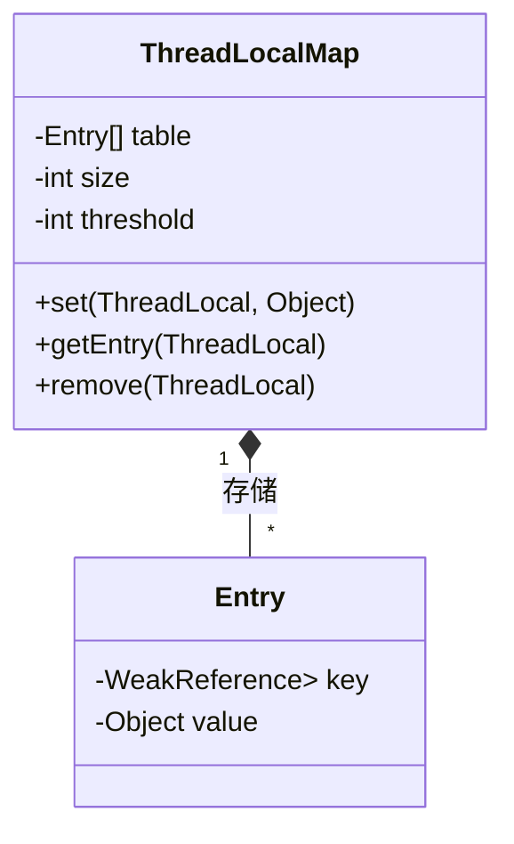
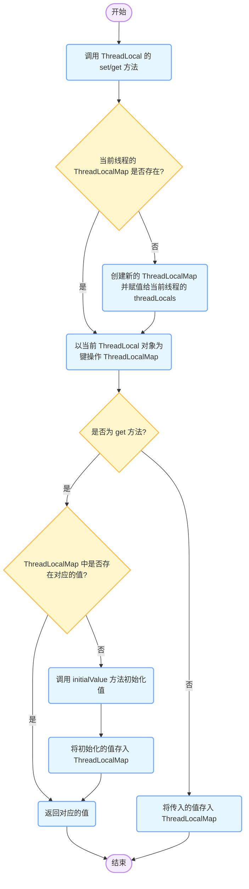

```mermaid
classDiagram
    class ThreadLocalMap {
        -Entry[] table
        -int size
        -int threshold
        +set(ThreadLocal<?>, Object)
        +getEntry(ThreadLocal<?>)
        +remove(ThreadLocal<?>)
    }
    
    class Entry {
        -WeakReference<ThreadLocal<?>> key
        -Object value
    }
    
    ThreadLocalMap "1" *-- "*" Entry : 存储
```
 

```mermaid
graph TD;
    classDef startend fill:#F5EBFF,stroke:#BE8FED,stroke-width:2px;
    classDef process fill:#E5F6FF,stroke:#73A6FF,stroke-width:2px;
    classDef decision fill:#FFF6CC,stroke:#FFBC52,stroke-width:2px;
    
    A([开始]):::startend --> B(调用 ThreadLocal 的 set/get 方法):::process;
    B --> C{当前线程的 ThreadLocalMap 是否存在?}:::decision;
    C -->|是| D(以当前 ThreadLocal 对象为键操作 ThreadLocalMap):::process;
    C -->|否| E(创建新的 ThreadLocalMap 并赋值给当前线程的 threadLocals):::process;
    E --> D;
    D --> F{是否为 get 方法?}:::decision;
    F -->|是| G{ThreadLocalMap 中是否存在对应的值?}:::decision;
    G -->|是| H(返回对应的值):::process;
    G -->|否| I(调用 initialValue 方法初始化值):::process;
    I --> J(将初始化的值存入 ThreadLocalMap):::process;
    J --> H;
    F -->|否| K(将传入的值存入 ThreadLocalMap):::process;
    H --> L([结束]):::startend;
    K --> L;
```
