---
title: 日志
tags: []
mathjax: true
cover: https://img.loliapi.cn/i/pc/img129.webp
categories: []
date: 2025-04-30
published: false
abbrlink: 485079eb
---

## day0x01 整合基础设施--Nacos
 采用官方最近[毕业版本推荐](https://github.com/alibaba/spring-cloud-alibaba/wiki/%E7%89%88%E6%9C%AC%E8%AF%B4%E6%98%8E?spm=5238cd80.5e8a737d.0.0.460f7e845BL6BA)

给定长链接（如miniourl等等），将其映射为短链接
为短链接的访问添加权限，超过规定时间无法访问，过期。（应用场景就是分享文件）
对短链接的审计，统计，面板可以进行管理
有机制能对失效短链接进行清理
要求性能高
后续可能会添加需求，确保扩展性，维护性强

```dot
digraph IncrementalStorage {
    // 全局设置
    rankdir=TB;
    splines=ortho;
    nodesep=0.7;
    ranksep=1.0;
    fontname="Arial";
    fontsize=11;
    
    // 节点和边样式
    node [shape=box, style="rounded,filled", fillcolor="#f5f5f5", fontname="Arial", fontsize=10];
    edge [fontname="Arial", fontsize=9];
    
    // 主要组件
    client [label="客户端应用", shape=ellipse, fillcolor="#d0e0ff"];
    
    subgraph cluster_app {
        label="Spring Boot 应用";
        style="rounded,filled";
        fillcolor="#e6ffe6";
        margin=15;
        
        controller [label="REST 控制器"];
        fileService [label="文件服务"];
        versionService [label="版本服务"];
        deltaService [label="增量服务\n(文本/二进制差异计算)"];
        lockService [label="锁服务"];
    }
    
    minio [label="MinIO\n对象存储", fillcolor="#ffe0c0"];
    mysql [label="MySQL\n数据库", fillcolor="#ffd0d0"];
    redis [label="Redis\n缓存与锁", fillcolor="#e0d0ff"];
    
    // === 文件上传流程 ===
    client -> controller [label="1.1 上传新文件", color="#0066CC"];
    controller -> fileService [label="1.2 处理上传", color="#0066CC"];
    fileService -> mysql [label="1.3 创建元数据\n(file_info + version)", color="#0066CC"];
    fileService -> minio [label="1.4 存储完整版本\n(/{fileId}/v1)", color="#0066CC"];
    fileService -> controller [label="1.5 上传完成", color="#0066CC"];
    controller -> client [label="1.6 返回文件信息", color="#0066CC"];
    
    // === 文件编辑流程 ===
    client -> controller [label="2.1 请求编辑锁", color="#009900", constraint=false];
    controller -> lockService [label="2.2 尝试锁定", color="#009900"];
    lockService -> redis [label="2.3 设置锁\n(file:lock:{fileId})", color="#009900"];
    redis -> lockService [label="2.4 锁定结果", color="#009900"];
    lockService -> controller [label="2.5 锁状态", color="#009900"];
    controller -> client [label="2.6 编辑权限", color="#009900"];
    
    client -> controller [label="2.7 提交变更", color="#009900", constraint=false];
    controller -> fileService [label="2.8 处理新版本", color="#009900"];
    fileService -> mysql [label="2.9 获取当前版本", color="#009900"];
    mysql -> fileService [label="2.10 版本信息", color="#009900"];
    fileService -> minio [label="2.11 获取基础版本", color="#009900"];
    minio -> fileService [label="2.12 基础内容", color="#009900"];
    fileService -> deltaService [label="2.13 计算增量", color="#009900"];
    
    // 增量决策点
    deltaDecision [label="增量大小?", shape=diamond, fillcolor="#ffffcc"];
    deltaService -> deltaDecision [label="2.14 比较", color="#009900"];
    deltaDecision -> fileService [label="< 70% - 使用增量", color="#009900"];
    deltaDecision -> fileService [label="≥ 70% - 使用完整", color="#CC6600", style="dashed"];
    
    fileService -> minio [label="2.15a 存储增量\n(/deltas/{fileId}/v{n})", color="#009900"];
    fileService -> minio [label="2.15b 存储完整版本\n(/{fileId}/v{n})", color="#CC6600", style="dashed"];
    
    fileService -> mysql [label="2.16 更新版本元数据\n(DELTA或FULL)", color="#009900"];
    fileService -> lockService [label="2.17 释放锁", color="#009900"];
    lockService -> redis [label="2.18 移除锁", color="#009900"];
    fileService -> controller [label="2.19 编辑完成", color="#009900"];
    controller -> client [label="2.20 成功响应", color="#009900"];
    
    // === 文件下载流程 ===
    client -> controller [label="3.1 下载请求\n(fileId, version)", color="#CC0000", constraint=false];
    controller -> versionService [label="3.2 获取版本", color="#CC0000"];
    versionService -> mysql [label="3.3 获取版本元数据", color="#CC0000"];
    mysql -> versionService [label="3.4 存储类型与路径", color="#CC0000"];
    
    // 版本类型决策
    versionDecision [label="版本\n类型?", shape=diamond, fillcolor="#ffffcc"];
    versionService -> versionDecision [color="#CC0000"];
    
    // 完整版本路径
    versionDecision -> minio [label="FULL", color="#CC0000"];
    minio -> versionService [label="3.5a 获取完整内容", color="#CC0000"];
    
    // 增量版本路径
    subgraph cluster_delta_resolve {
        label="增量解析过程";
        style=dotted;
        color="#0000CC";
        
        getBase [label="3.5b 获取基础版本"];
        getDelta [label="3.6b 获取增量数据"];
        applyDelta [label="3.7b 应用增量到基础版本"];
        
        getBase -> getDelta -> applyDelta;
    }
    
    versionDecision -> getBase [label="DELTA", color="#0000CC", style="dashed"];
    getBase -> minio [label="基础版本请求", color="#0000CC", style="dashed"];
    minio -> getBase [label="基础版本内容", color="#0000CC", style="dashed"];
    getDelta -> minio [label="增量请求", color="#0000CC", style="dashed"];
    minio -> getDelta [label="增量内容", color="#0000CC", style="dashed"];
    applyDelta -> deltaService [label="重构", color="#0000CC", style="dashed"];
    deltaService -> applyDelta [label="完整文件", color="#0000CC", style="dashed"];
    
    applyDelta -> versionService [color="#0000CC", style="dashed"];
    versionService -> controller [label="3.8 文件内容", color="#CC0000"];
    controller -> client [label="3.9 下载文件", color="#CC0000"];
    
    // === 版本链优化流程 ===
    scheduler [label="定时任务", shape=component, fillcolor="#e0e0e0"];
    optimizer [label="链优化器", fillcolor="#e0e0e0"];
    
    scheduler -> optimizer [label="4.1 运行优化", color="#660066", constraint=false];
    optimizer -> mysql [label="4.2 查找长增量链", color="#660066"];
    mysql -> optimizer [label="4.3 链信息", color="#660066"];
    optimizer -> minio [label="4.4 获取文件版本", color="#660066"];
    minio -> optimizer [label="4.5 版本内容", color="#660066"];
    optimizer -> minio [label="4.6 创建新基础版本", color="#660066"];
    optimizer -> mysql [label="4.7 更新元数据\n(将DELTA转为FULL)", color="#660066"];
}
```

