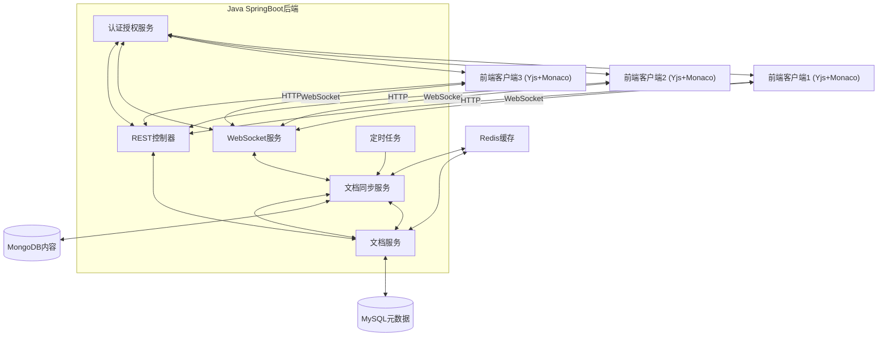
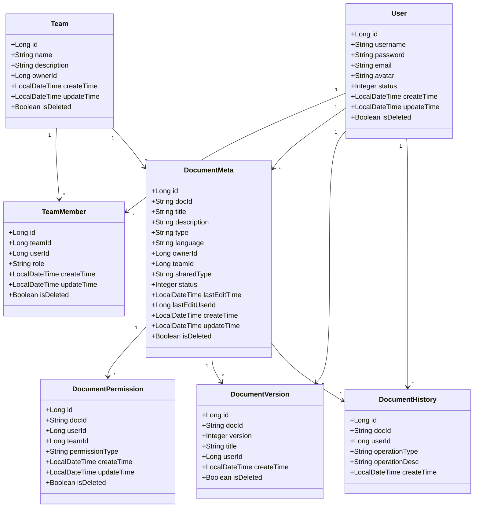
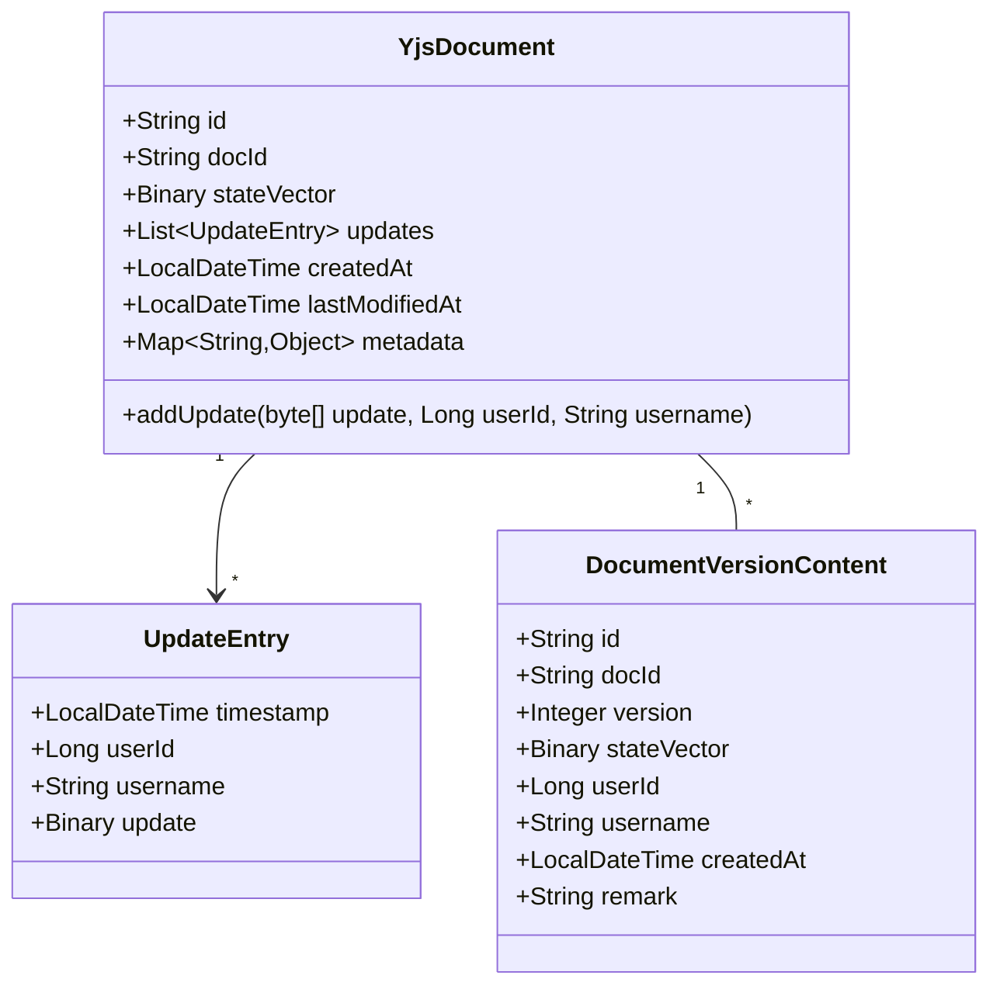
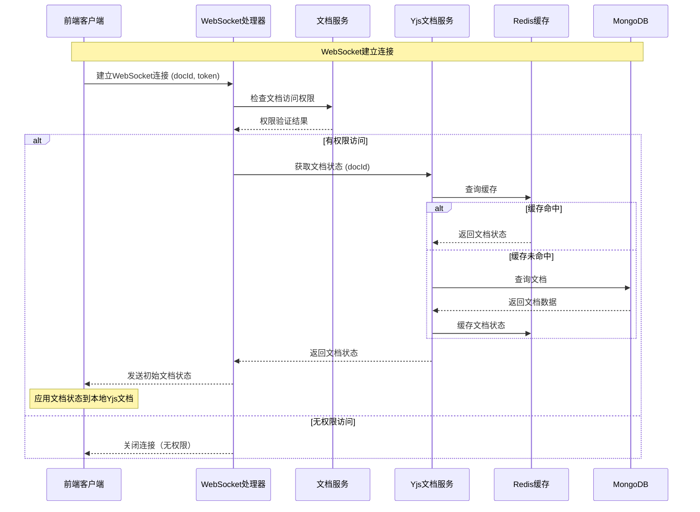
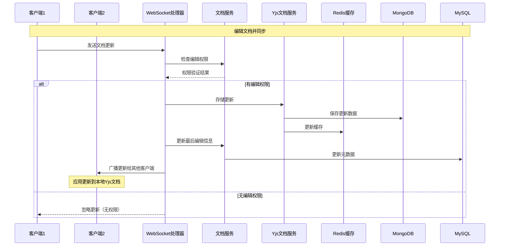
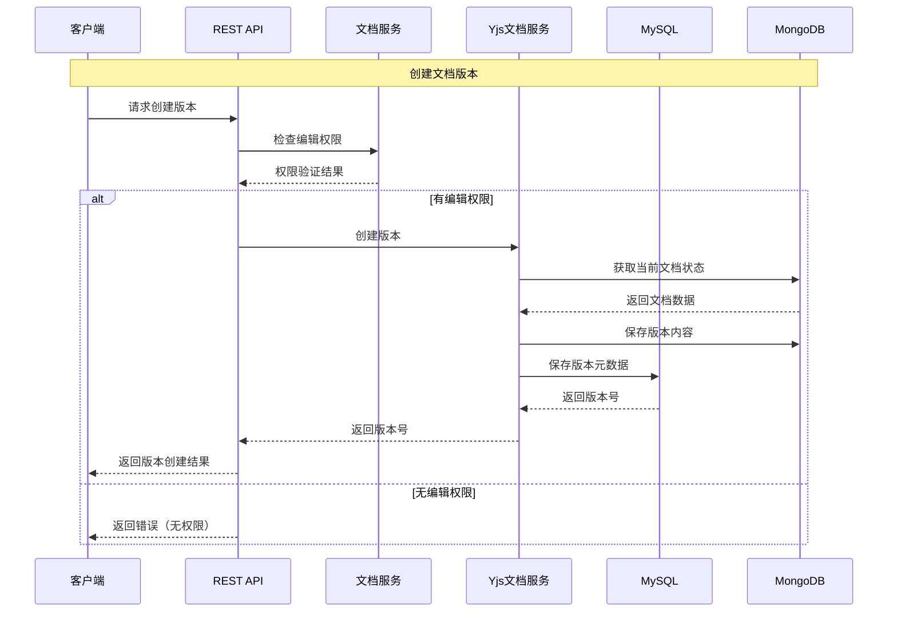
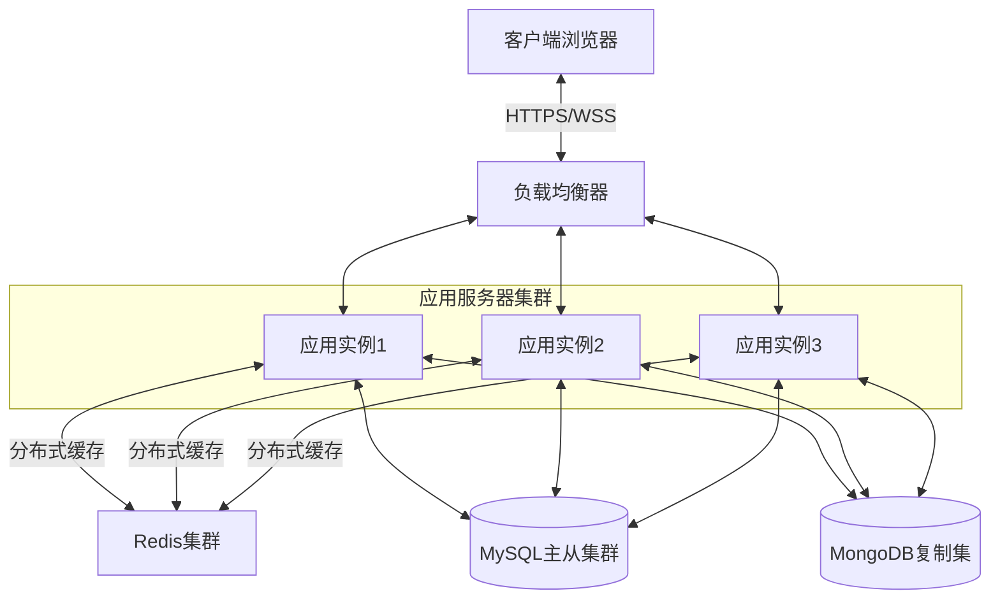

## 1. 系统架构概述

本文档详细描述了支持Yjs+Monaco前端协同编辑的后端系统架构实现。该系统采用MySQL存储元数据和MongoDB存储文档内容的混合数据存储策略，主要负责实时数据同步、持久化存储、版本管理和用户权限控制。



## 2. 数据模型设计

### 2.1 MySQL元数据模型



### 2.2 MongoDB文档内容模型



## 3. 系统组件详细实现

### 3.1 数据访问层

实现了基于MyBatis Plus的MySQL数据访问层和基于Spring Data MongoDB的MongoDB数据访问层：

#### 3.1.1 MySQL Mapper

MyBatis Plus Mapper接口用于操作MySQL中的元数据，包括：

- DocumentMetaMapper - 文档元数据管理
- DocumentPermissionMapper - 文档权限管理
- DocumentVersionMapper - 文档版本管理
- TeamMapper - 团队管理
- TeamMemberMapper - 团队成员管理
- UserMapper - 用户管理

#### 3.1.2 MongoDB Repository

MongoDB Repository接口用于操作MongoDB中的文档内容数据，包括：

- YjsDocumentRepository - Yjs文档内容管理
- DocumentVersionContentRepository - 文档版本内容管理

### 3.2 服务层

服务层实现了业务逻辑处理，主要包括以下服务：

#### 3.2.1 YjsDocumentService

Yjs文档服务，负责文档内容的存储、加载和版本管理：

```java
public interface YjsDocumentService {
    // 存储文档更新
    void storeUpdate(String docId, byte[] update, Long userId, String username);
    
    // 获取文档当前状态
    byte[] getDocumentState(String docId);
    
    // 创建文档版本
    Integer createVersion(String docId, String title, String remark, Long userId, String username);
    
    // 获取文档版本列表
    List<DocumentVersionVO> getVersions(String docId);
    
    // 回滚到指定版本
    byte[] rollbackToVersion(String docId, Integer version);
    
    // 其他文档操作方法
    // ...
}
```

#### 3.2.2 DocumentService

文档元数据服务，负责文档元数据和权限管理：

```java
public interface DocumentService {
    // 创建文档
    String createDocument(DocumentMeta documentMeta, Long userId);
    
    // 更新文档元数据
    boolean updateDocument(DocumentMeta documentMeta, Long userId);
    
    // 删除文档
    boolean deleteDocument(String docId, Long userId);
    
    // 获取文档元数据
    DocumentMetaVO getDocumentMeta(String docId, Long userId);
    
    // 查询文档列表
    IPage<DocumentMetaVO> getUserDocuments(Page<DocumentMetaVO> page, Long userId, String keyword);
    
    // 检查文档权限
    boolean checkPermission(String docId, Long userId, String permissionType);
    
    // 其他文档元数据和权限操作方法
    // ...
}
```

### 3.3 WebSocket通信

WebSocket是协同编辑的核心，用于实时传输Yjs更新数据：

#### 3.3.1 WebSocket配置

```java
@Configuration
@EnableWebSocket
public class WebSocketConfig implements WebSocketConfigurer {
    
    @Autowired
    private YjsWebSocketHandler yjsWebSocketHandler;
    
    @Override
    public void registerWebSocketHandlers(WebSocketHandlerRegistry registry) {
        registry.addHandler(yjsWebSocketHandler, "/ws/yjs/{docId}")
                .addInterceptors(new HttpSessionHandshakeInterceptor())
                .setAllowedOrigins("*");
    }
}
```

#### 3.3.2 WebSocket处理器

```java
@Component
@Slf4j
public class YjsWebSocketHandler extends TextWebSocketHandler {
    
    @Autowired
    private YjsDocumentService yjsDocumentService;
    
    @Autowired
    private DocumentService documentService;
    
    private final Map<String, Set<WebSocketSession>> roomSessions = new ConcurrentHashMap<>();
    private final Map<String, Long> sessionUserMap = new ConcurrentHashMap<>();
    
    // WebSocket连接建立
    @Override
    public void afterConnectionEstablished(WebSocketSession session) throws Exception {
        // 实现连接建立逻辑
    }
    
    // 处理二进制消息（Yjs更新）
    @Override
    protected void handleBinaryMessage(WebSocketSession session, BinaryMessage message) throws Exception {
        // 实现Yjs更新处理逻辑
    }
    
    // 其他WebSocket处理方法
    // ...
}
```

### 3.4 REST API控制器

REST API提供了文档管理的HTTP接口：

#### 3.4.1 文档控制器

```java
@RestController
@RequestMapping("/documents")
@Slf4j
public class DocumentController {
    
    @Autowired
    private DocumentService documentService;
    
    @Autowired
    private YjsDocumentService yjsDocumentService;
    
    // 创建文档
    @PostMapping
    public ApiResult<String> createDocument(@RequestBody DocumentMeta documentMeta) {
        // 实现创建文档逻辑
    }
    
    // 更新文档
    @PutMapping("/{docId}")
    public ApiResult<Boolean> updateDocument(@PathVariable String docId, @RequestBody DocumentMeta documentMeta) {
        // 实现更新文档逻辑
    }
    
    // 其他文档管理接口
    // ...
}
```

### 3.5 缓存配置

使用Redis缓存提高系统性能：

```java
@Configuration
@EnableCaching
public class RedisConfig {
    
    @Bean
    public RedisTemplate<String, Object> redisTemplate(RedisConnectionFactory factory) {
        // Redis模板配置
    }
    
    @Bean
    public CacheManager cacheManager(RedisConnectionFactory factory) {
        // 缓存管理器配置
    }
}
```

### 3.6 定时任务

实现文档优化定时任务：

```java
@Component
@Slf4j
public class DocumentMaintenanceTask {
    
    @Autowired
    private YjsDocumentService yjsDocumentService;
    
    @Autowired
    private DocumentMetaMapper documentMetaMapper;
    
    // 每天凌晨2点执行文档优化任务
    @Scheduled(cron = "0 0 2 * * ?")
    public void optimizeDocuments() {
        // 实现文档优化逻辑
    }
}
```

## 4. 关键流程实现

### 4.1 文档加载流程



### 4.2 文档更新流程



### 4.3 版本管理流程



## 5. 数据存储优化策略

### 5.1 MongoDB数据模型优化

MongoDB中的Yjs文档存储采用以下优化策略：

1. **增量更新存储**：
    
    - 将每次更新作为单独条目存储在`updates`数组中
    - 包含时间戳、用户ID和用户名等元数据
2. **状态向量存储**：
    
    - 保存最新的文档状态向量，用于新客户端快速加载
3. **更新合并策略**：
    
    - 当更新数量超过阈值时，进行更新合并
    - 仅保留最近的N个更新，减少存储空间占用

```java
private void optimizeUpdates(YjsDocument document) {
    List<YjsDocument.UpdateEntry> updates = document.getUpdates();
    
    if (updates.size() <= KEEP_RECENT_UPDATES) {
        return;
    }
    
    log.info("Optimizing document: {}, updates count: {}", document.getDocId(), updates.size());
    
    // 仅保留最近的N个更新
    document.setUpdates(
            updates.subList(updates.size() - KEEP_RECENT_UPDATES, updates.size())
    );
    
    log.info("After optimization, updates count: {}", document.getUpdates().size());
}
```

### 5.2 缓存策略

使用Redis缓存优化文档加载性能：

1. **文档状态缓存**：
    
    - 缓存文档最新状态，避免频繁查询MongoDB
    - 设置合理的过期时间（如10分钟）
2. **文档元数据缓存**：
    
    - 缓存文档元数据，提高权限检查性能
    - 设置较长的过期时间（如30分钟）

```java
@Cacheable(value = "documentStates", key = "#docId")
public byte[] getDocumentState(String docId) {
    return yjsDocumentRepository.findByDocId(docId)
            .map(doc -> doc.getStateVector().getData())
            .orElse(null);
}

@CacheEvict(value = "documentStates", key = "#docId")
public void storeUpdate(String docId, byte[] update, Long userId, String username) {
    // 存储更新逻辑
}
```

### 5.3 定时优化任务

实现定时任务对文档进行优化：

```java
@Scheduled(cron = "0 0 2 * * ?")
public void optimizeDocuments() {
    log.info("Starting document optimization task");
    
    List<DocumentMeta> documents = documentMetaMapper.selectList(
            new LambdaQueryWrapper<DocumentMeta>()
                    .eq(DocumentMeta::getStatus, 0)
    );
    
    // 遍历文档进行优化
    for (DocumentMeta document : documents) {
        try {
            yjsDocumentService.optimizeDocument(document.getDocId());
        } catch (Exception e) {
            log.error("Failed to optimize document: {}", document.getDocId(), e);
        }
    }
}
```

## 6. 部署架构

系统可以采用以下部署架构实现高可用性和可扩展性：



### 6.1 水平扩展支持

1. **无状态应用设计**：
    
    - WebSocket连接信息保存在Redis中
    - 用户会话通过Redis共享
    - 所有应用实例可以处理任何请求
2. **Redis分布式锁**：
    
    - 用于处理并发操作
    - 保证数据一致性
3. **MongoDB分片**：
    
    - 对大型文档集合进行分片
    - 提高数据存储和查询性能

## 7. 安全机制

系统实现了多层次的安全机制：

1. **身份验证**：
    
    - 基于token的认证机制
    - WebSocket连接需要有效token
2. **权限控制**：
    
    - 文档级权限控制（读、写、管理）
    - 用户和团队权限分离
    - 权限缓存优化
3. **数据加密**：
    
    - 传输加密(HTTPS/WSS)
    - 敏感数据存储加密

## 8. 总结与展望

本系统实现了一个完整的基于Yjs+Monaco的协同编辑平台，采用MySQL+MongoDB混合存储架构，具有以下特点：

1. **实时协作**：基于WebSocket的低延迟实时数据同步
2. **高效存储**：混合存储架构，元数据与内容分离
3. **版本管理**：完整的文档版本控制功能
4. **权限系统**：细粒度的文档访问权限控制
5. **性能优化**：缓存、增量更新和定时优化机制

### 未来优化方向

1. **WebSocket集群扩展**：
    
    - 实现基于Redis的WebSocket集群，支持更大规模用户同时在线
2. **文档快照机制**：
    
    - 优化大文档的历史版本存储，实现快照与增量更新结合的存储策略
3. **实时分析**：
    
    - 添加用户编辑行为分析功能，提供协作洞察
4. **离线编辑支持**：
    
    - 实现基于IndexedDB的本地存储机制，支持离线编辑后的自动同步