# Yjs+Monaco Java后端架构设计文档

## 1. 系统架构概述

本文档详细描述了支持Yjs+Monaco前端协同编辑的Java后端系统架构设计。该系统主要负责实时数据同步、持久化存储、版本管理和用户权限控制。

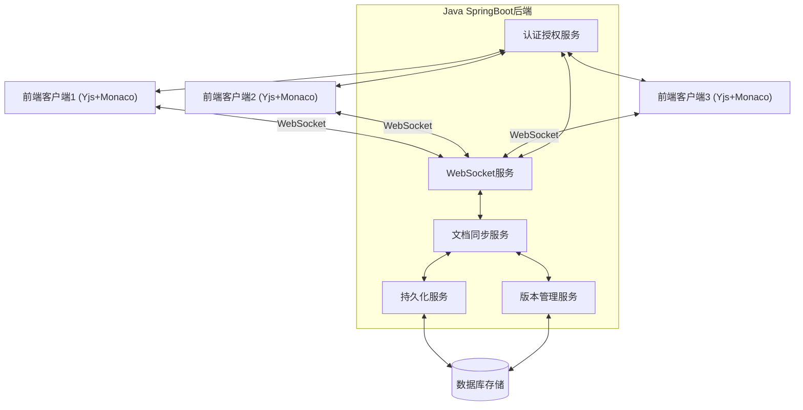

## 2. 核心组件说明

### 2.1 WebSocket服务

负责管理前端客户端与后端的实时通信，实现Yjs文档更新的接收和分发。

### 2.2 文档同步服务

处理Yjs文档更新的核心逻辑，包括数据合并、冲突处理等。

### 2.3 持久化服务

负责将Yjs文档状态安全地存储到数据库中，并支持高效的数据加载。

### 2.4 版本管理服务

维护文档的历史版本，支持查看历史和回滚操作。

### 2.5 认证授权服务

控制用户对文档的访问权限，保证数据安全。

## 3. 数据模型设计

### 3.1 MongoDB数据模型

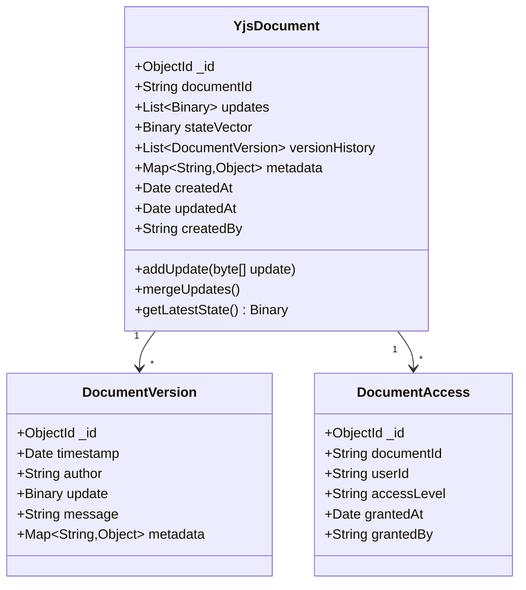

MongoDB的文档模型非常适合存储Yjs的数据结构，因为它们都是基于JSON的格式，并且MongoDB的Binary类型可以高效地存储Yjs的二进制更新数据。

## 4. 关键流程设计

### 4.1 文档加载流程

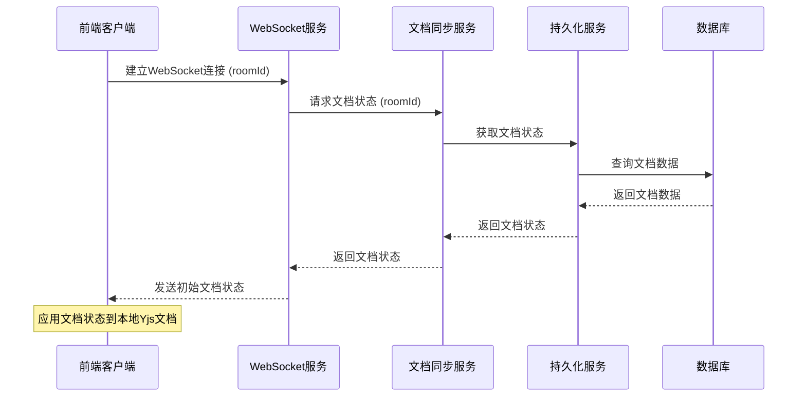

### 4.2 文档更新流程

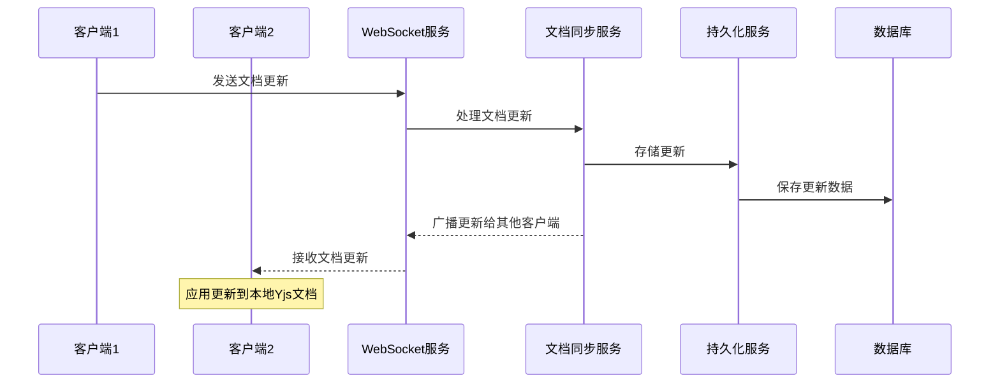

### 4.3 版本回滚流程

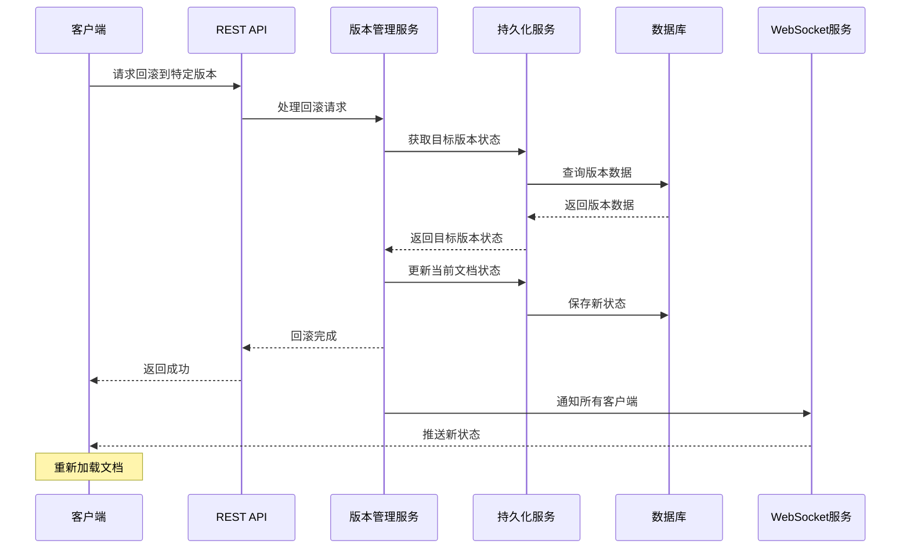

## 5. 系统组件详细设计

### 5.1 WebSocket处理器

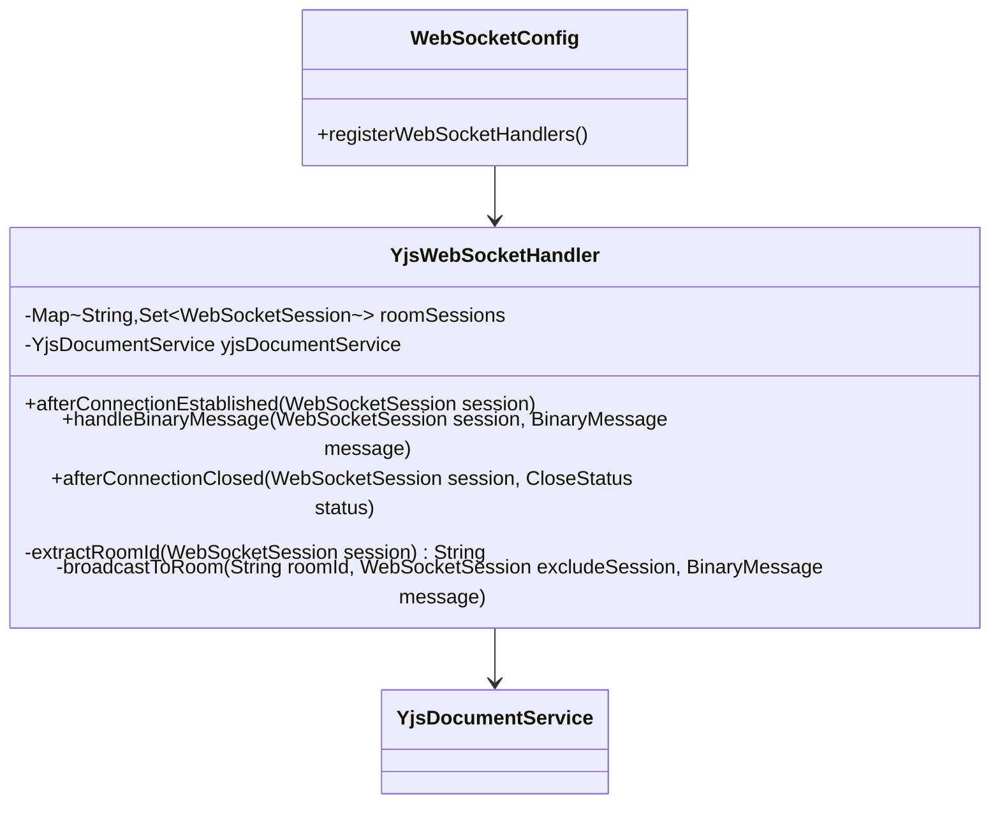

### 5.2 MongoDB文档服务

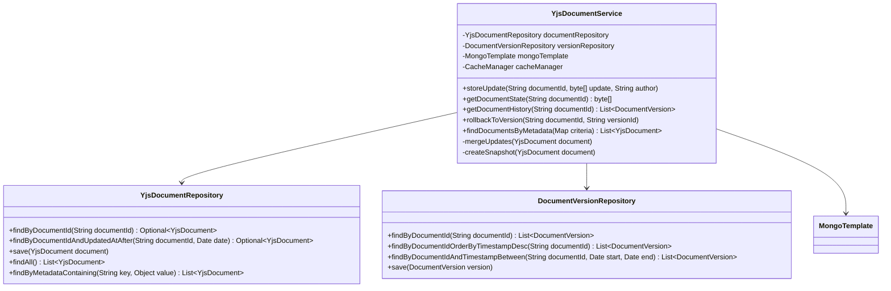

### 5.3 REST API控制器

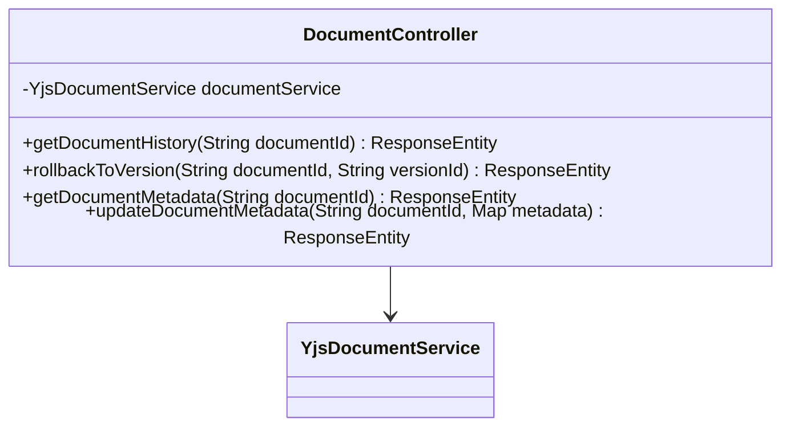

## 6. MongoDB优化策略

### 6.1 性能优化架构

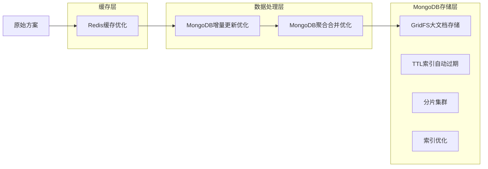

### 6.2 MongoDB增量更新与合并策略

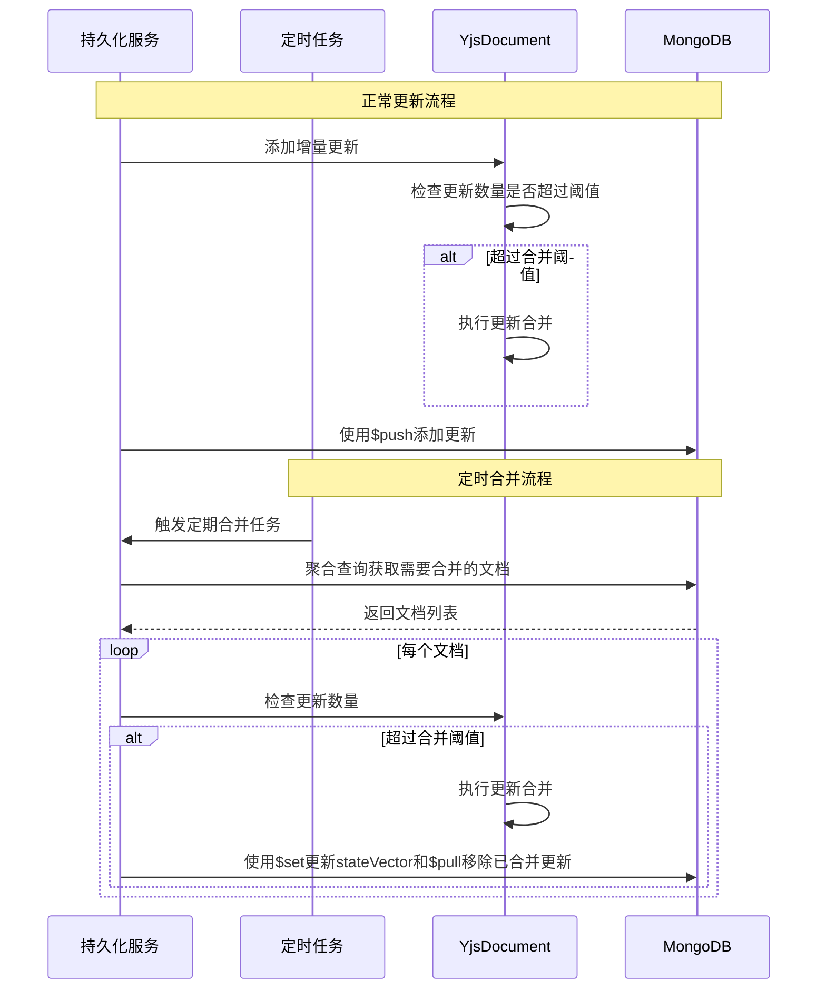

### 6.3 MongoDB大文档存储策略

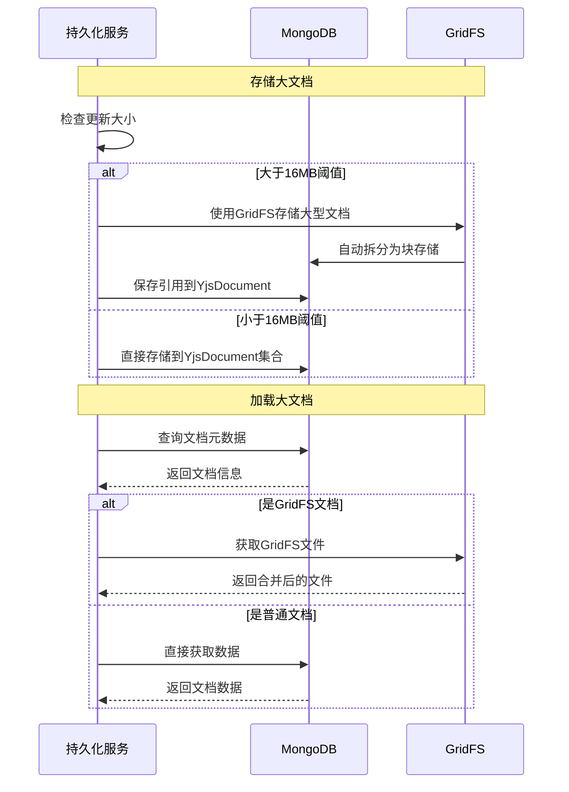

### 6.4 MongoDB特有优化技术

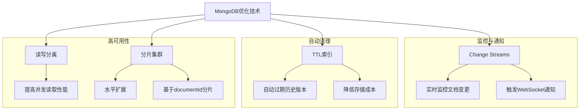

## 7. MongoDB部署架构

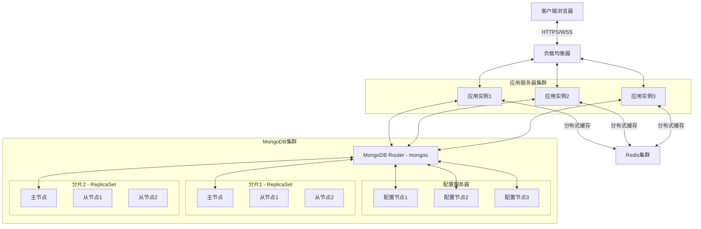

### 7.1 MongoDB分片策略

针对Yjs协同编辑系统的MongoDB分片策略:

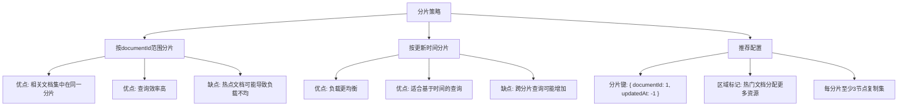

## 8. 实现配置

### 8.1 MongoDB与Spring Boot配置

```yaml
spring:
  application:
    name: yjs-collaborative-editor
  
  # MongoDB配置
  data:
    mongodb:
      uri: mongodb://localhost:27017/yjsdb
      auto-index-creation: true
      field-naming-strategy: org.springframework.data.mapping.model.SnakeCaseFieldNamingStrategy
      # 对大型文档的支持配置
      gridfs:
        database: yjsdb
        bucket: yjsDocuments
  
  # WebSocket配置
  websocket:
    max-text-message-buffer-size: 8192
    max-binary-message-buffer-size: 1048576  # 1MB
    # 对于超大文档支持更大的消息大小
    max-binary-message-buffer-size-large: 10485760  # 10MB
  
  # 缓存配置
  cache:
    type: redis
    redis:
      time-to-live: 3600000  # 1小时
      cache-null-values: false
  
  # Redis配置 (用于缓存和WebSocket会话共享)
  redis:
    host: localhost
    port: 6379
    timeout: 10000
    lettuce:
      pool:
        max-active: 8
        max-idle: 8
        min-idle: 0
```

#### MongoDB索引配置示例

```java
@Configuration
public class MongoConfig extends AbstractMongoClientConfiguration {
    
    @Override
    protected String getDatabaseName() {
        return "yjsdb";
    }
    
    @Bean
    public MongoCustomConversions customConversions() {
        List<Converter<?, ?>> converters = new ArrayList<>();
        // 添加自定义Binary到byte[]的转换器
        converters.add(new BinaryToByteArrayConverter());
        converters.add(new ByteArrayToBinaryConverter());
        return new MongoCustomConversions(converters);
    }
    
    @EventListener(ApplicationReadyEvent.class)
    public void initIndicesAfterStartup() {
        MongoTemplate mongoTemplate = mongoTemplate();
        
        // 为documentId创建唯一索引
        IndexOperations indexOps = mongoTemplate.indexOps(YjsDocument.class);
        IndexDefinition documentIdIndex = new Index().on("documentId", Sort.Direction.ASC).unique();
        indexOps.ensureIndex(documentIdIndex);
        
        // 为更新时间创建索引以支持高效查询
        IndexDefinition updatedAtIndex = new Index().on("updatedAt", Sort.Direction.DESC);
        indexOps.ensureIndex(updatedAtIndex);
        
        // 为元数据字段创建索引以支持查询
        IndexDefinition metadataIndex = new Index().on("metadata.title", Sort.Direction.ASC);
        indexOps.ensureIndex(metadataIndex);
    }
}
```

### 8.2 项目依赖 (MongoDB版本)

```xml
<dependencies>
    <!-- Spring Boot -->
    <dependency>
        <groupId>org.springframework.boot</groupId>
        <artifactId>spring-boot-starter-web</artifactId>
    </dependency>
    <dependency>
        <groupId>org.springframework.boot</groupId>
        <artifactId>spring-boot-starter-websocket</artifactId>
    </dependency>
    
    <!-- MongoDB支持 -->
    <dependency>
        <groupId>org.springframework.boot</groupId>
        <artifactId>spring-boot-starter-data-mongodb</artifactId>
    </dependency>
    <!-- MongoDB GridFS支持 - 用于大文档存储 -->
    <dependency>
        <groupId>org.mongodb</groupId>
        <artifactId>mongodb-driver-sync</artifactId>
    </dependency>
    
    <!-- 缓存支持 -->
    <dependency>
        <groupId>org.springframework.boot</groupId>
        <artifactId>spring-boot-starter-cache</artifactId>
    </dependency>
    <dependency>
        <groupId>org.springframework.boot</groupId>
        <artifactId>spring-boot-starter-data-redis</artifactId>
    </dependency>
    
    <!-- 安全支持 -->
    <dependency>
        <groupId>org.springframework.boot</groupId>
        <artifactId>spring-boot-starter-security</artifactId>
    </dependency>
    <dependency>
        <groupId>io.jsonwebtoken</groupId>
        <artifactId>jjwt</artifactId>
        <version>0.9.1</version>
    </dependency>
    
    <!-- WebSocket会话共享支持 -->
    <dependency>
        <groupId>org.springframework.session</groupId>
        <artifactId>spring-session-data-redis</artifactId>
    </dependency>
    
    <!-- 工具库 -->
    <dependency>
        <groupId>org.apache.commons</groupId>
        <artifactId>commons-lang3</artifactId>
    </dependency>
    <dependency>
        <groupId>commons-io</groupId>
        <artifactId>commons-io</artifactId>
        <version>2.11.0</version>
    </dependency>
    <dependency>
        <groupId>com.google.guava</groupId>
        <artifactId>guava</artifactId>
        <version>31.1-jre</version>
    </dependency>
    
    <!-- 用于处理二进制数据 -->
    <dependency>
        <groupId>com.fasterxml.jackson.dataformat</groupId>
        <artifactId>jackson-dataformat-cbor</artifactId>
    </dependency>
</dependencies>
```

## 9. 总结

本架构设计提供了一个完整的Java后端方案，用于支持基于Yjs+Monaco的协同编辑前端。该方案具有以下特点：

1. 使用WebSocket实现实时数据同步
2. 支持文档数据的高效持久化和加载
3. 提供完善的版本管理和历史回溯功能
4. 通过多种优化策略提高系统性能

通过此架构，可以构建一个稳定、高效、可扩展的协同编辑系统，满足各种复杂业务场景的需求。